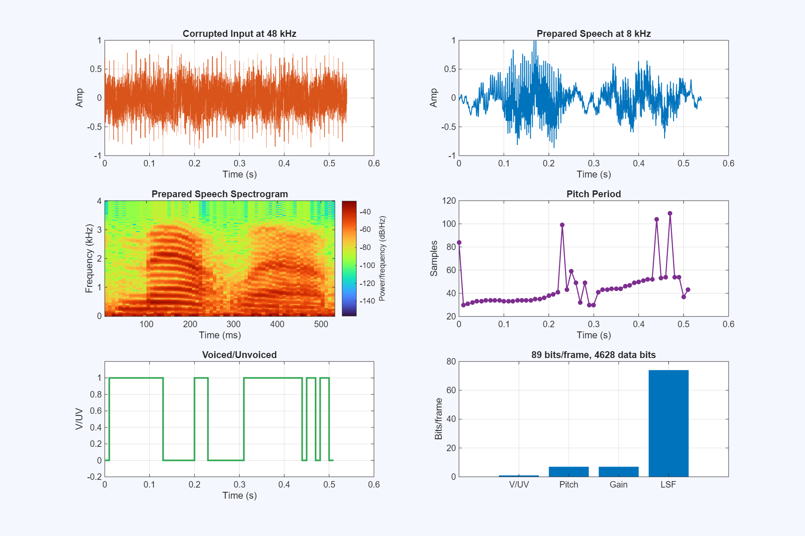
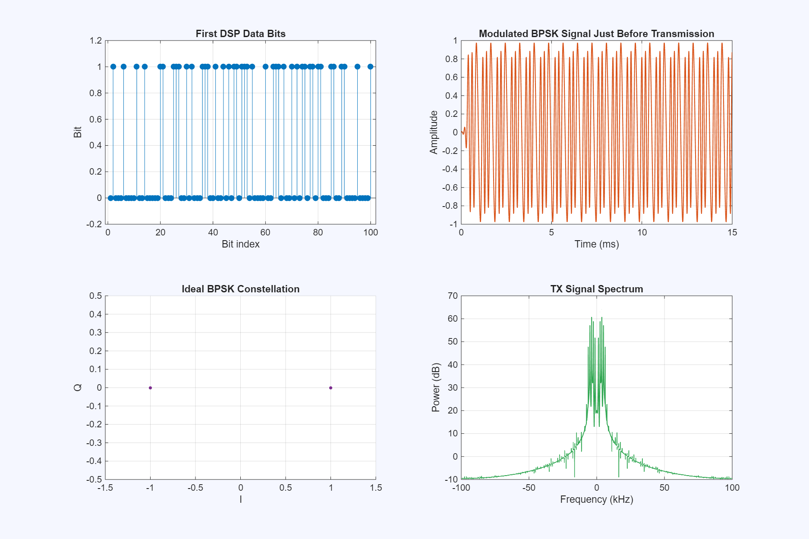
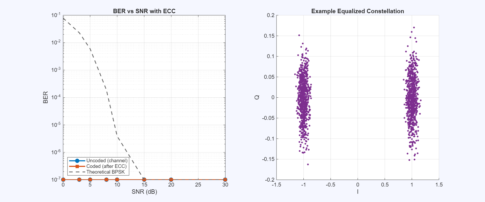
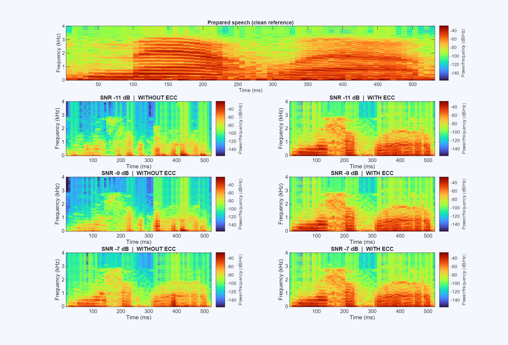
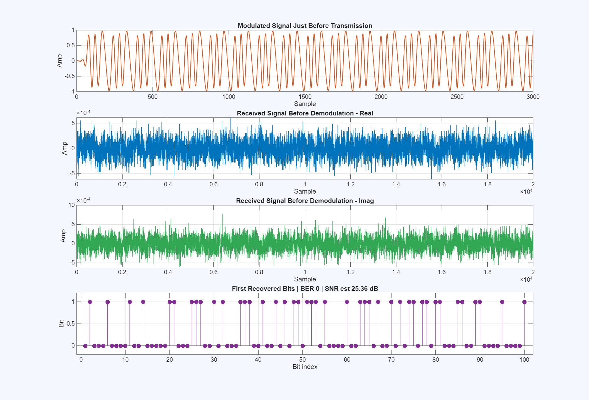
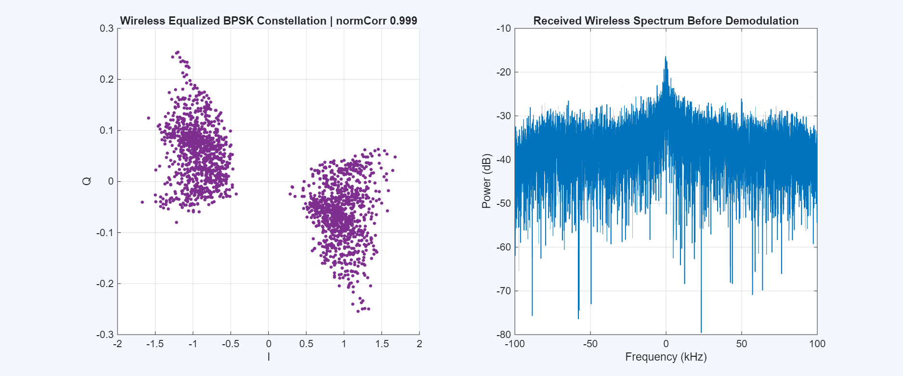
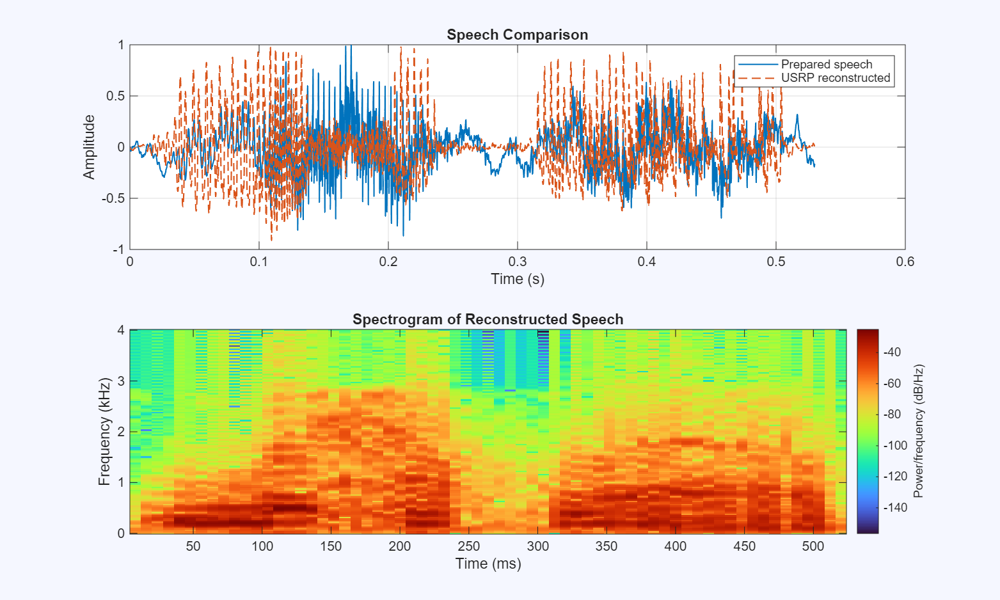

# 🎙️ EE3001 USRP BPSK Speech Transmission Project

<p align="center">
  <b>DSP-Based Speech Communication System using BPSK and NI USRP-2900</b>
</p>

<p align="center">
  Abdullah Gül University (AGÜ)  
  <br>
  Department of Electrical and Electronics Engineering
</p>

---

## 👥 Project Team

| Name            | University              | Department                             |
| --------------- | ----------------------- | -------------------------------------- |
| Derya İpek ER   | Abdullah Gül University | Electrical and Electronics Engineering |
| Serdar ALBAYRAK | Abdullah Gül University | Electrical and Electronics Engineering |

**Course:** EE3001 Telecommunication System Design Using DSP Capsule
**Project Type:** DSP + Wireless Communication + USRP Hardware Implementation

---

## 📌 Project Overview

This project implements an end-to-end wireless speech communication system using **DSP**, **BPSK modulation**, **error-correction coding**, and **NI USRP-2900 hardware**.

The system takes a corrupted **48 kHz speech signal**, processes it using speech coding techniques, transmits the compressed data through a USRP-based wireless link, and reconstructs the speech at the receiver.

Instead of transmitting raw audio samples, the system transmits compact speech parameters:

* LPC / LSF parameters
* Pitch
* Gain
* Voiced / Unvoiced information

This reduces the data rate while preserving the main speech structure.

---

## 🔁 Overall System Flow

```text
x_corrupt.mat
        ↓
Low-pass filtering + 8 kHz resampling
        ↓
LPC / LSF analysis
        ↓
Quantization
        ↓
Convolutional ECC encoding
        ↓
Preamble addition + BPSK mapping
        ↓
RRC pulse shaping
        ↓
NI USRP-2900 TX / RX wireless link
        ↓
Matched filtering + synchronization
        ↓
Phase correction + BPSK decision
        ↓
Viterbi decoding
        ↓
Dequantization
        ↓
Speech synthesis
        ↓
Final reconstructed speech
```

---

## 🧠 DSP Part

### 1. Speech Preparation

The corrupted input speech is filtered and downsampled:

```text
48 kHz → 8 kHz
```

This step reduces the data rate and keeps the important speech frequency range.

### 2. LPC / LSF Analysis

The 8 kHz speech is divided into short frames. For each frame, the system extracts:

* LSF parameters
* Pitch period
* Frame gain
* Voiced / Unvoiced decision

### 3. Quantization

Each frame is represented by **89 bits**.

For the tested speech file:

```text
52 frames × 89 bits/frame = 4628 message bits
```

### 4. Error Correction Coding

A rate-1/2 convolutional code is used for error protection.

```text
4628 message bits → 9268 coded bits
```

The receiver uses **Viterbi decoding** to recover the original message bits.

---

## 📡 Communication System

The communication part uses **Binary Phase Shift Keying (BPSK)**.

The BPSK mapping rule is:

```text
bit 0 → -1
bit 1 → +1
```

A known preamble is added before the data. This helps the receiver find the packet start and estimate the phase shift.

The signal is also shaped using a **Root Raised Cosine (RRC)** filter before USRP transmission.

---

## 🛰️ Hardware Setup

The project uses:

| Component          | Value                       |
| ------------------ | --------------------------- |
| Hardware           | NI USRP-2900                |
| Platform           | B200                        |
| Modulation         | BPSK                        |
| Carrier frequency  | 915 MHz                     |
| Sample rate        | 200 kHz                     |
| Symbol rate        | 10 ksym/s                   |
| Samples per symbol | 20                          |
| Pulse shaping      | Root Raised Cosine          |
| ECC                | Rate-1/2 convolutional code |
| Decoder            | Viterbi decoder             |

---

## 📊 Main Results

The real USRP hardware test was successful.

| Metric                          |            Result |
| ------------------------------- | ----------------: |
| Coded channel BER before ECC    |                 0 |
| Message BER after ECC           |                 0 |
| Estimated SNR                   |    about 23–25 dB |
| Normalized preamble correlation | about 0.998–0.999 |
| Preamble BER                    |                 0 |

These results show that the USRP link was clean and the receiver recovered the transmitted bits correctly.

The benefit of ECC was shown more clearly in the low-SNR software simulation. When the channel became noisy, the system without ECC produced bit errors, while the convolutional code with Viterbi decoding improved the final message recovery.

---

## 🖼️ Result Figures

### DSP Summary

This figure shows the DSP transmitter analysis, including prepared speech, spectrogram, pitch, voiced/unvoiced decision, and bit allocation.



---

### BPSK Modulation

This figure shows the first data bits, pulse-shaped BPSK signal, ideal BPSK constellation, and transmitted signal spectrum.



---

### BER and Constellation Simulation

This figure shows BER versus SNR and an example equalized BPSK constellation.



---

### Speech Quality with and without ECC

This figure compares reconstructed speech quality under low-SNR conditions with and without ECC.



---

### USRP Wireless Diagnostics

This figure shows the transmitted waveform, received real and imaginary IQ signals, and first recovered bits.



---

### USRP Receiver Spectrum and Constellation

This figure shows the equalized wireless BPSK constellation and received spectrum before demodulation.



---

### Final Speech Reconstruction

This figure compares the prepared speech and USRP reconstructed speech.



---

## 📁 Repository Contents

| File                                    | Description                                           |
| --------------------------------------- | ----------------------------------------------------- |
| `EE3001_DEMO.m`                         | Main MATLAB script for the complete system            |
| `x_corrupt.mat`                         | Input corrupted speech signal                         |
| `tx_bit_stream.txt`                     | Transmitted message bit stream                        |
| `rx_bit_stream.txt`                     | Recovered message bit stream                          |
| `dsp_summary.png`                       | DSP transmitter analysis figure                       |
| `modulation_demo.png`                   | BPSK modulation figure                                |
| `bpsk_simulation_ber_constellation.png` | BER and constellation simulation result               |
| `speech_quality_vs_snr.png`             | Speech reconstruction comparison with and without ECC |
| `usrp_wireless_diagnostics.png`         | USRP hardware receive diagnostics                     |
| `usrp_rx_spectrum.png`                  | Received spectrum and equalized constellation         |
| `final_speech_reconstruction.png`       | Final speech reconstruction result                    |
| `README.md`                             | Project documentation                                 |

---

## ▶️ How to Run

1. Open MATLAB.
2. Put `EE3001_DEMO.m` and `x_corrupt.mat` in the same folder.
3. Run the main MATLAB script.
4. When MATLAB asks:

```text
Run USRP wireless antenna test? 1=yes, 0=no:
```

Enter:

```text
1
```

to run the USRP hardware test.

Enter:

```text
0
```

to run only the software simulation.

---

## 📝 Important Notes

* The reconstructed speech is not expected to be exactly the same as the original waveform.
* This is because the system transmits speech parameters, not raw audio samples.
* The final speech may sound slightly synthetic, which is normal for LPC/LSF-based parametric speech coding.
* The hardware BER was zero because the real USRP link was clean during the test.
* ECC is still useful because it protects the system under noisier channel conditions.
* Artificial AWGN is used only in the software simulation.
* In the hardware test, the received signal includes real USRP and channel noise.

---

## 🛠️ Tools and Technologies

* MATLAB
* Communications Toolbox
* DSP System Toolbox
* NI USRP-2900
* BPSK modulation
* LPC / LSF speech coding
* Convolutional coding
* Viterbi decoding
* Root Raised Cosine pulse shaping
* USRP wireless transmission and reception

---

## 📚 Course Information

| Item          | Information                                              |
| ------------- | -------------------------------------------------------- |
| Course        | EE3001 Telecommunication System Design Using DSP Capsule |
| University    | Abdullah Gül University                                  |
| Department    | Electrical and Electronics Engineering                   |
| Project Topic | DSP-Based Speech Communication with BPSK and USRP        |
| Hardware      | NI USRP-2900                                             |
| Main Output   | Reconstructed speech after wireless transmission         |

---

## ✅ Summary

This project shows that a corrupted speech signal can be compressed using LPC/LSF speech parameters, protected with convolutional ECC, transmitted using BPSK over USRP hardware, and reconstructed successfully at the receiver.

The hardware test achieved zero measured BER, high preamble correlation, and successful speech reconstruction.
